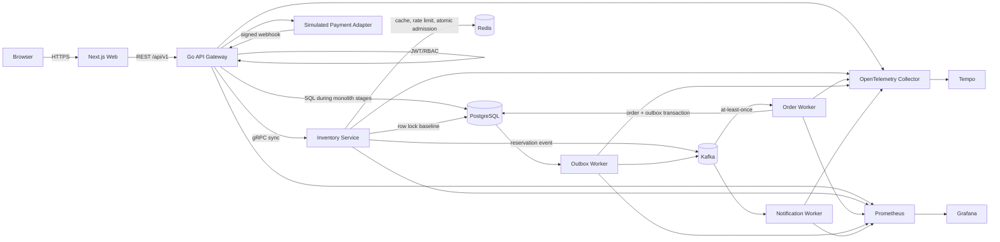

# FlashFlow Engineering Execution Plan

> 本文件是后续 Codex 的可执行工程计划。需求事实以 `Idea.md` 为准；若实现发现二者冲突，先记录决策并修订本计划，再继续编码。所有性能数字在实测前必须保持 `TBD`。

## Progress

| Field | Value |
| --- | --- |
| Current Phase | Phase 0 — Repository & Development Baseline |
| Completed Tasks | 0 |
| Total Tasks | 97 |
| Current Focus | 0.1 固化工具链、版本与架构决策基线 |
| Blockers | None；影响后期部署与真实支付集成的问题记录在 Open Questions，不阻塞本地 MVP |
| Last Updated | 2026-08-21 |

## Scope and Priorities

### Project Goal

构建一个以 Go 为核心的高并发预约与异步订单平台，覆盖活动浏览、有限库存预约、订单与模拟支付，并能用自动化测试和真实压测证明：不超卖、HTTP/Kafka 重试不产生重复业务数据、故障后可恢复、系统可部署且可观测。前端只承担演示闭环，工程投入约为后端 70%、前端 30%。

### Core Business Scenarios

1. 用户注册/登录后浏览活动，在热点活动开放时提交带 `Idempotency-Key` 的预约请求。
2. 100 份库存面对最高 10,000 并发请求时，成功预约总量不得超过库存；售罄、限流和依赖故障必须有明确响应。
3. 预约成功后异步创建订单；消息重复、消费者崩溃或 Kafka 暂时不可用不得产生重复订单或永久丢失已提交事件。
4. 用户在有效期内完成模拟支付，或预约超时后自动释放库存；支付 Webhook 重放必须安全。
5. 管理员维护演示活动/库存并查看业务与系统指标；工程人员可通过日志、指标和 Trace 定位慢请求及消息积压。

### Non-functional Targets

- **Correctness:** 任意并发级别均满足 `confirmed + active_reserved <= initial_stock`；一个 reservation 最多一个 order；同一幂等请求返回同一业务结果。
- **Performance:** 完成 100/1,000/5,000/10,000 并发场景，记录 RPS、P50/P95/P99、错误率、CPU、内存、DB 连接、缓存命中率及 Kafka lag；阈值在 Phase 11 根据基线实测确定，不预造数据。
- **Availability and recovery:** 缓存读取故障降级 PostgreSQL；Redis 库存模式故障时 fail closed；所有外部调用有超时；进程支持优雅关闭；异步事件至少一次投递并可重放。
- **Security:** 密码强哈希、短期 Access Token、Refresh Token 轮换、RBAC、参数化 SQL、输入边界校验、CORS、限流、Webhook 签名与 Secret 外置。
- **Scalability:** API 无状态可水平扩容；订单消费者按 Kafka partition/consumer group 扩展；热点库存以 Redis 原子脚本控制；数据库连接池有硬上限。
- **Operability:** JSON 结构化日志、Prometheus 指标、OpenTelemetry Trace、健康/就绪探针、Dashboard、告警规则、可重复的本地与 Kubernetes 部署。

### Priority Classification

**Must Have**

- 模块化单体 MVP、PostgreSQL schema/migrations、认证/RBAC、活动/预约/订单/模拟支付 API。
- PostgreSQL 行锁正确性基线、HTTP 幂等、预约过期、单元/集成/并发/API 测试。
- Redis cache-aside 与原子库存实现、Kafka 异步订单、幂等消费者、Transactional Outbox、retry/DLQ。
- Docker Compose、结构化日志、指标/Trace、CI、Kubernetes 基础清单、前端演示闭环、真实基准报告。

**Should Have**

- Inventory 独立服务与内部 gRPC、单飞防击穿、分布式限流、通知 worker、Grafana Dashboard、HPA、故障注入自动化。
- PostgreSQL 与 Redis 两种库存模式可配置切换和同环境对比；游标分页与查询计划记录。

**Nice to Have / Future Work**

- Schema Registry、CDC/Debezium、Redis Cluster、PostgreSQL read replica、Helm、Argo CD、Service Mesh、多地域、真实第三方支付、专用日志聚合和高级 Chaos 平台。
- Circuit breaker 仅在同步的非核心下游确有持续故障问题时引入；首版通知采用异步队列，不需要它。

## Assumptions

1. 仓库当前只有 `Idea.md`、`Idea_en.md` 和 `LICENSE`，没有已实现代码，因此所有 task 初始为未完成。
2. 首个可运行版本是单 Go module 的模块化单体；在基线、契约和边界稳定后仅拆出 Inventory gRPC 服务与异步 workers，不扩张为大量微服务。
3. 选择 Chi、标准库 `slog`、`pgx/v5`、`sqlc`、PostgreSQL、Redis、Kafka、OpenTelemetry、Prometheus/Grafana/Tempo、Next.js/TypeScript/Tailwind。
4. 金额以最小货币单位整数保存，首版单一币种；每次 reservation 的 quantity 允许 `1..10`，库存按 quantity 原子扣减。
5. 预约有效期默认 10 分钟且可配置。时间统一存 UTC，API 使用 RFC 3339；ID 使用 UUID，不暴露自增序列。
6. 支付是可替换端口后的本地模拟提供方；Webhook 使用 HMAC 签名。真实支付供应商不属于首版。
7. PostgreSQL 是业务持久化事实来源。Redis cache 可丢失并重建；Redis 高并发库存模式是受控的 admission ledger，成功请求只有在 Kafka 确认接收后才返回，孤儿 reservation 由补偿与过期扫描回收。
8. Kafka 采用 at-least-once；不承诺基础设施级 exactly-once，只通过唯一约束、processed events 和幂等状态转换实现业务 exactly-once effect。
9. 本地 Docker Compose 提供完整依赖；Kubernetes 是生产模拟环境，托管 PostgreSQL/Redis/Kafka 的选型留给部署目标决定，仓库不把有状态集群清单冒充生产方案。
10. 管理员需要最小的活动创建/更新/上架和库存初始化 API，尽管 `Idea.md` 的公共 API 列表未显式列出它们。

## Open Questions / Decisions

| ID | Question / Decision Needed | Default Used by Plan | Decision Deadline |
| --- | --- | --- | --- |
| OQ-1 | Go module path / GitHub owner 是什么？ | 初始化时使用仓库远端推导；没有 remote 时暂用 `github.com/example/flashflow` 并记录替换点 | Task 0.1 |
| OQ-2 | 首个 Kubernetes 目标是 kind、minikube 还是云厂商？ | kind 作为可重复验收环境；云特定 CD 参数化 | Task 12.2 |
| OQ-3 | 是否接入真实支付供应商？ | 否；实现模拟 provider + 签名 webhook | Phase 8 之前可覆盖默认值 |
| OQ-4 | Redis 库存模式是否要在首版成为默认生产路径？ | 否；PostgreSQL 行锁默认，Redis 模式 feature flag 开启并在验证后再切换 | Task 5.8 |
| OQ-5 | Admin Dashboard 是读应用聚合 API 还是直接嵌 Grafana？ | UI 读受保护的轻量业务指标 API，并链接 Grafana；不让浏览器直连 Prometheus | Task 10.6 |
| OQ-6 | 性能 SLO 的目标硬件与最低阈值是什么？ | Phase 11 先记录环境和 baseline，再基于结果提交可解释阈值 | Task 11.4 |

## Architecture Overview

### Evolution Strategy

- **Stages 1–5:** 一个 Go API 进程内保持 auth、event、inventory、reservation、order、payment 模块边界。先用 PostgreSQL 事务/行锁证明正确性，再添加 Redis 缓存与可切换的库存策略。
- **Stage 6:** 引入 Kafka 和 workers，将订单创建从请求路径移出；业务写入与 outbox 写入处于同一 PostgreSQL 事务。
- **Stage 7 onward:** 在稳定端口后将 Inventory 独立为 gRPC 服务，API 成为外部 REST gateway；Order/Outbox/Notification 是独立 worker 进程，共享明确 schema ownership，而不是随意跨模块写表。



### Communication and Consistency Boundaries

- 外部同步接口使用版本化 REST/JSON；错误统一为稳定 code、message、details、request_id。创建预约在同步持久路径返回 `201`，异步路径在库存接受且 Kafka ack 后返回 `202 PROCESSING`。
- API 到 Inventory 使用带 deadline 的 gRPC；认证后的 user/context、request ID 和 W3C Trace Context 传播到下游。
- Kafka event 使用 versioned envelope：`event_id`、`event_type`、`schema_version`、`occurred_at`、`traceparent`、`aggregate_id`、`payload`。`event_id` 用于去重，业务活动 ID 作为 partition key（字段命名使用 `activity_id`，避免和消息 ID 混淆）。
- PostgreSQL 模式在单事务内创建 reservation 并扣库存。Redis 模式用 Lua 原子校验幂等、扣减、写 pending marker/expiry index；Kafka 发布失败执行幂等补偿，崩溃遗留由 sweeper 回收；消费者持久化 reservation/order 并受唯一约束保护。
- Cache-aside 只缓存活动读模型；写后删除缓存。缓存连接错误降级 DB，not-found 使用短 TTL negative cache，热点 miss 用 singleflight 合并，TTL 加 jitter。
- Outbox worker 用 `FOR UPDATE SKIP LOCKED` claim 批次、指数退避和可见的 attempt/error 字段；发布成功再标记，崩溃可重复投递，消费者必须幂等。

### Domain and Data Ownership

| Aggregate / Table | Owner | Key invariants |
| --- | --- | --- |
| users, refresh_tokens | auth | email 唯一；token 只存 hash；轮换后旧 token 不可复用 |
| events, inventories | event/inventory | stock 非负；`available + reserved + sold` 与初始量可核对；已上架活动的关键字段受限修改 |
| reservations, idempotency_keys | reservation | `(user_id, idempotency_key)` 唯一；状态机只允许合法跃迁；过期/释放至多一次 |
| orders | order | `reservation_id` 唯一；用户只能读自己的订单；支付金额来自服务端 |
| payments | payment | provider event/payment reference 唯一；Webhook 重放不重复确认订单 |
| outbox_events, processed_events | messaging | 业务写与 outbox 同事务；consumer/event 唯一；处理和去重记录同事务 |

### API Contract Summary

- Auth: `POST /api/v1/auth/register|login|refresh|logout`。
- Events: `GET /api/v1/events`, `GET /api/v1/events/{id}`；Admin: `POST /api/v1/admin/events`, `PATCH /api/v1/admin/events/{id}`, `PUT /api/v1/admin/events/{id}/inventory`, publish/unpublish action。
- Reservations: `POST /api/v1/events/{id}/reservations`, `GET /api/v1/reservations/{id}`。
- Orders: `GET /api/v1/orders?cursor=...`, `GET /api/v1/orders/{id}`。
- Payments: `POST /api/v1/payments/{orderId}`, `POST /api/v1/payments/webhook`。
- Operations: `GET /healthz`, `GET /readyz`, `GET /metrics`; admin summary endpoint只返回允许暴露的聚合值。

## Architecture Decisions

| Decision | Choice | Reason / Consequence |
| --- | --- | --- |
| Initial architecture | Modular monolith, then extract Inventory and workers | 先保证业务闭环和本地事务，边界稳定后才承担网络与部署成本 |
| HTTP router | Chi | 轻量、贴近 `net/http`、middleware 组合清楚，足够覆盖有限 API |
| Logging | Go `slog` JSON | 标准库、依赖少，统一结构字段并可关联 trace/request |
| Database access | PostgreSQL + pgxpool + sqlc + explicit SQL | 显式展示事务、锁、索引和查询计划，避免 ORM 隐藏关键一致性逻辑 |
| Migration tool | golang-migrate CLI/library | SQL migration 可审查、可回滚，易用于本地和 CI |
| External/internal API | REST externally, gRPC internally after extraction | 浏览器兼容与内部强类型契约各自明确，不提前引入 RPC 成本 |
| Cache | Redis cache-aside | 只优化热点活动读取；故障可绕过，PostgreSQL 仍是事实来源 |
| Inventory strategies | PostgreSQL row lock baseline + opt-in Redis Lua | 先证明强一致正确性，再实测高并发优化；保留可对照实现 |
| Messaging | Kafka, at-least-once | 削峰、异步订单与独立扩容；以幂等而非不现实的端到端 exactly-once 应对重复 |
| Reliable publication | Transactional Outbox | 消除 PostgreSQL commit 后直接 Kafka publish 的永久双写缺口 |
| Event format | Versioned JSON envelope in v1 | 无需首版 Schema Registry 即可演进；严格校验，未来可迁移 Protobuf/Registry |
| Auth | Argon2id passwords; short JWT access + opaque rotating refresh tokens | 降低密码与长期 token 泄露风险；服务端可撤销 refresh session |
| Observability | OTel + Prometheus + Grafana + Tempo | 覆盖 metrics/traces；日志先 stdout JSON，避免首版引入额外日志集群 |
| Frontend | Next.js + TypeScript + Tailwind | 小范围页面快速形成演示闭环，不建立复杂 design system |
| Deployment | Multi-stage distroless images + Compose + plain Kubernetes manifests | 本地可复现，生产模拟可水平扩展；Helm/Argo CD 留作 future work |

## Target Repository Structure

```text
.
├── cmd/
│   ├── api/                  # REST gateway / modular-monolith entry point
│   ├── inventory/            # extracted gRPC inventory service
│   ├── order-worker/         # reservation.created consumer
│   ├── outbox-worker/        # PostgreSQL outbox relay
│   └── notification-worker/  # non-critical notification consumer
├── internal/
│   ├── auth/                 # credentials, tokens, RBAC
│   ├── event/                # activity catalog and admin operations
│   ├── inventory/            # stock ports, PG/Redis strategies, Lua scripts
│   ├── reservation/          # idempotency, lifecycle, expiration
│   ├── order/                # order state and queries
│   ├── payment/              # provider port, simulator, webhook handling
│   ├── messaging/            # envelopes, Kafka, retry/DLQ, outbox
│   ├── observability/        # logs, metrics, traces
│   └── platform/             # config, HTTP/gRPC servers, DB/Redis clients, shutdown
├── api/openapi/              # checked-in REST contract
├── proto/inventory/v1/       # protobuf contract and generated Go code
├── migrations/               # ordered up/down PostgreSQL migrations
├── queries/                  # sqlc SQL grouped by owning module
├── web/                      # Next.js demonstration UI
├── tests/
│   ├── integration/          # testcontainers-backed component tests
│   ├── e2e/                  # browser-to-worker business journeys
│   ├── concurrency/          # oversell/idempotency/race scenarios
│   └── failure/              # repeatable dependency/crash scenarios
├── loadtest/                 # k6 read, reservation, spike, stress, soak suites
├── deployments/
│   ├── docker/               # service Dockerfiles
│   └── kubernetes/           # namespace, workloads, services, ingress, HPA
├── observability/
│   ├── prometheus/           # scrape and alert rules
│   ├── grafana/              # provisioned dashboards/datasources
│   └── otel/                 # collector and Tempo configuration
├── configs/                  # non-secret local defaults/examples
├── scripts/                  # deterministic setup, seed, checks, failure helpers
├── docs/                     # ADRs, architecture, reliability and measured reports
├── .github/workflows/        # CI, image publishing and deployment
├── .env.example
├── docker-compose.yml
├── Makefile
├── sqlc.yaml
├── buf.yaml
├── go.mod
└── README.md
```

`internal/*` 包不得绕过 owner 直接操作其他模块表；跨模块调用走公开 application interface。`pkg/` 默认不创建，只有确认存在可供仓库外复用的稳定库时才加入。

## Cross-cutting Implementation Rules

- 每个请求生成/接受 request ID；所有 handler/service/repository 接受 `context.Context`，DB、Redis、Kafka 和 gRPC 都设置可配置 deadline。
- Domain error 映射稳定 HTTP/gRPC code：validation 400、unauthenticated 401、forbidden 403、not found 404、conflict/idempotency mismatch 409、sold out 409、rate limit 429、async accepted 202、dependency unavailable 503。
- Retry 只覆盖明确的 transient error，采用带 jitter 的指数退避和最大次数；validation、权限、售罄等永久错误不得重试。
- 所有状态转换通过带前置状态条件的 SQL/Lua 完成。唯一约束是最后一道一致性防线，不能只依赖应用先查后写。
- 配置通过环境变量加载、启动时校验并打印脱敏摘要；Secret 不提交。测试配置必须显式，禁止静默连接开发/生产数据库。
- 日志不得包含密码、JWT、refresh token、Webhook secret 或完整敏感 payload；指标 label 不得包含 user/order/reservation 等高基数字段。

## Testing Strategy

| Layer | Coverage | Introduced / Expanded |
| --- | --- | --- |
| Unit | 状态机、validation、token、幂等判定、retry policy、cache key/Lua result mapping | 每个业务 Phase 同步添加 |
| Database integration | migrations、constraints、事务/行锁、游标分页、outbox claim | Phases 1, 3, 6 |
| Redis integration | cache hit/miss/negative cache、TTL、singleflight、限流、Lua 原子扣减/补偿 | Phases 4–5 |
| Kafka/worker integration | produce/consume、重复事件、retry/DLQ、offset commit、outbox crash window | Phase 6 onward |
| API contract/security | OpenAPI、状态码、错误 envelope、认证/RBAC、CORS、Webhook signature | Phases 2–3, 8 |
| Concurrency/race | 100 库存/10,000 请求、同 key 重放、worker pool、`go test -race` | Phases 3, 5, 11 |
| End-to-end | register → event → reserve → order → pay；expiration → release | Phases 8, 10–11 |
| Failure/recovery | Redis/Kafka/Postgres down/slow、consumer/outbox/API kill、SIGTERM | Phase 11 |
| Load/stress | read, ramp, spike, stress, soak；PG vs Redis、cache off/on | Phases 4, 5, 11 |

测试随功能提交，不把正确性测试推迟到 Phase 11。集成测试优先使用 testcontainers 的真实 PostgreSQL/Redis/Kafka；仅在不可控外部边界使用 mock/fake。

## Execution Rules for Codex

1. 开始工作前完整读取 `Idea.md` 和 `plan.md`。
2. 确认当前 repository 状态和未提交变更，保护用户已有修改。
3. 找到第一个尚未完成且 Dependencies 已满足的 Task。
4. 一次专注完成一个 Task 或一个高度相关的小 Task group。
5. 实现完成后运行相关 formatter、linter 和 tests。
6. 逐条验证 Acceptance Criteria，并保存必要的可复现命令/实测产物。
7. 只有验证全部通过后才能将对应 checkbox 从 `[ ]` 改为 `[x]`，同时更新 Progress 计数、Current Focus 和 Last Updated。
8. 如果实现中发现计划错误，先更新 `plan.md` 的假设/决策/依赖并记录原因。
9. 不得因为方便跳过、删除或弱化失败测试；flaky test 必须修复或记录 blocker。
10. 不得把未实现、未验证或仅创建空壳的内容标记完成。
11. 保持已建立的架构、模块边界、API contract 和代码风格一致。
12. 避免无关重构；生成代码与手写代码分开，禁止手改生成文件。
13. 每个 Phase 结束时从干净环境验证构建、迁移、启动、核心测试和关闭流程。
14. Task 被阻塞时在 Progress/该 Task 下记录 blocker、证据和解除条件，不得假装完成。
15. 优先保持仓库始终可构建、可测试；涉及 schema/event contract 的破坏性改变必须提供兼容迁移方案。
16. 所有 benchmark 记录硬件、OS、依赖与 Go 版本、配置、数据规模、命令和原始结果；未测试字段保持 `TBD`。
17. 每个 Phase 结束后做一次 scope review，将非必要技术移至 Future Work，避免为了技术名词增加复杂度。

## Phased Execution Plan

### Phase 0 — Repository & Development Baseline

**Goal**

建立可重复、可构建、带快速反馈的空项目骨架，并固化版本、命令、配置和架构记录方式。

**Dependencies**

None。

**Tasks**

- [ ] **0.1 Toolchain and decision baseline** — 确认 module path，固定 Go/Node/pnpm、PostgreSQL/Redis/Kafka、sqlc、migration、buf/protoc、golangci-lint、k6 版本；创建 `go.mod`、`.tool-versions` 或等价版本文件及 `docs/adr/0001-*`。验证：全新环境能按文档安装/检查版本。
- [ ] **0.2 Repository skeleton** — 按 Target Repository Structure 创建必要目录与最小 package（不提前创建无内容微服务），添加 `.gitignore`、`.editorconfig`、版权头/贡献约定。验证：目录职责与 imports 不形成循环依赖。
- [ ] **0.3 Configuration contract** — 在 `internal/platform/config` 实现强类型环境配置、默认值和启动校验，创建 `.env.example`；区分必填 Secret 与非敏感参数。测试缺失、非法 duration/URL、Secret 脱敏。
- [ ] **0.4 Process and HTTP skeleton** — 创建 `cmd/api`、Chi router、`/healthz`、版本信息、统一 JSON/error writer、request ID middleware、context-aware server timeout 和 SIGINT/SIGTERM 优雅关闭。测试 shutdown 不泄漏 goroutine。
- [ ] **0.5 Developer commands** — 创建 Makefile/task commands：`dev/build/test/test-race/test-integration/lint/generate/migrate-*/docker-*/load-test/proto`，确保命令失败时返回非零且不吞输出。
- [ ] **0.6 Formatting and static checks** — 配置 gofmt/goimports、golangci-lint、go vet、前端预留的 ESLint/Prettier 规则与 pre-commit 可选脚本；生成物目录正确排除。验证在空骨架通过。
- [ ] **0.7 Local dependency baseline** — 创建最小 `docker-compose.yml` 启动 PostgreSQL，并用 healthcheck、volume、固定开发凭证与 profile 为后续 Redis/Kafka/observability 留扩展点；文档化启动/清理但不删除非本项目 volume。

**Acceptance Criteria**

- `make build`, `make test`, `make lint` 在干净 checkout 通过；API 启动后 `/healthz` 返回 200 和版本字段。
- SIGTERM 后停止接收新请求，在超时内完成在途请求并以 0 退出；无 Secret 出现在日志。
- 仅 PostgreSQL profile 启动成功且 healthcheck 可用。

### Phase 1 — Domain Contracts & Persistence Foundation

**Goal**

在业务 handler 前稳定领域状态机、REST 契约和数据库 schema，使后续模块在清晰约束上实现。

**Dependencies**

Phase 0。

**Tasks**

- [ ] **1.1 Domain vocabulary and state machines** — 在 `internal/{event,reservation,order,payment}` 定义无基础设施依赖的实体、值对象和状态转换：event draft/published/closed，reservation processing/active/confirmed/expired/cancelled/failed，order pending/paid/cancelled。覆盖非法跃迁、quantity/金额/时间边界单测。
- [ ] **1.2 REST contract** — 创建 `api/openapi/flashflow.v1.yaml`，定义 auth/events/reservations/orders/payments/admin、cursor pagination、Idempotency-Key、JWT security、错误 envelope 和 200/201/202/204/4xx/5xx 响应；加入 contract lint。
- [ ] **1.3 Initial relational schema** — 设计 users、refresh_tokens、events、inventories、reservations、idempotency_keys、orders、payments、outbox_events、processed_events，写 `migrations/000001_*` up/down；加入 PK/FK/check/unique 和审计时间字段。
- [ ] **1.4 Index and ownership review** — 为 email、event status/start time、reservation user/event/status/expiry、order user+created cursor、outbox pending、processed event 添加与查询匹配的索引；在 `docs/database.md` 记录 owner、invariant 和预期 query plan。
- [ ] **1.5 sqlc and pgxpool setup** — 创建 `sqlc.yaml`、分模块 `queries/`、生成代码边界、pgxpool 参数与连接超时；repository adapter 不把 pgx/sqlc 类型泄漏到 domain。
- [ ] **1.6 Migration runner and seed** — 实现安全的 migrate up/down/status 与幂等 demo seed（用户、admin、draft/published events、库存）；生产模式禁止自动 destructive down/seed。
- [ ] **1.7 Persistence integration harness** — 使用 testcontainers-go 启动隔离 PostgreSQL、执行全部 migrations，并为每测试创建独立 schema/database；验证 up→down→up、constraints、UTC 和连接清理。
- [ ] **1.8 ADR and consistency checkpoint** — 写 ADR：模块化单体、PostgreSQL/sqlc、ID/时间/金额、状态机与 schema ownership；核对 OpenAPI、domain 和 migration 命名完全一致。

**Acceptance Criteria**

- 新 PostgreSQL 实例可一条命令迁移并幂等 seed；所有 down migration 在测试库可逆。
- DB 约束能拒绝负库存、重复 email、重复 reservation→order、非法 quantity，并支持目标 cursor query。
- OpenAPI lint、domain unit tests、PostgreSQL integration tests 均通过。

### Phase 2 — Application Foundation, Authentication & Authorization

**Goal**

完成安全的身份生命周期、通用 HTTP 中间件和生产可用的错误/日志基线。

**Dependencies**

Phase 1。

**Tasks**

- [ ] **2.1 Application composition** — 建立 handler→application service→repository ports/adapters 的显式 wiring；事务边界由 service 控制，加入 clock/ID generator 接口便于确定性测试。
- [ ] **2.2 Registration** — 实现 email 规范化、密码策略、Argon2id hash 参数、重复注册冲突和注册 endpoint；不得记录密码，测试并发重复 email 仅成功一次。
- [ ] **2.3 Login and access JWT** — 实现恒定语义的凭证错误、短期 JWT（issuer/audience/subject/role/expiry/jti）、签名验证与 Bearer middleware；测试过期、错误签名、错误 audience 和 clock skew。
- [ ] **2.4 Refresh rotation and logout** — 生成高熵 opaque refresh token，仅存 hash/session metadata；refresh 时原子轮换并检测 reuse，logout 撤销 session。测试并发 refresh 仅一个成功，重放触发 session family 撤销。
- [ ] **2.5 RBAC and ownership middleware** — 定义 USER/ADMIN policy；管理员路由强制 ADMIN，reservation/order 读取在 service 层校验 owner，防止仅靠路由保护造成越权。
- [ ] **2.6 Validation and error mapping** — 统一 body size、JSON unknown field、UUID、pagination、quantity、时间校验；domain/infra errors 稳定映射 HTTP code 和机器可读 code，panic recovery 不泄漏 stack 给客户端。
- [ ] **2.7 Security middleware** — 配置 allowlist CORS、安全响应头、合理 request/header timeout、body limit；生产环境拒绝弱 JWT/refresh/Webhook secret，proxy IP 解析仅信任配置的代理。
- [ ] **2.8 Structured logging baseline** — 用 `slog` 输出 JSON，贯穿 request_id、trace_id（可用时）、user_id、route、status、latency；建立敏感字段过滤和日志级别配置，测试 token/password 不出现。

**Acceptance Criteria**

- register→login→refresh→logout API contract 测试通过，重复/并发操作满足唯一性和 rotation 规则。
- USER 无法访问 admin 或他人资源；无 token/坏 token/过期 token 分别稳定返回 401，权限不足返回 403。
- 所有错误响应含 code 与 request_id，服务端日志含关联字段但不含 Secret。

### Phase 3 — Synchronous MVP APIs & PostgreSQL Correctness Baseline

**Goal**

交付只依赖 PostgreSQL 的完整同步业务闭环，并以行锁/事务建立零超卖基线。

**Dependencies**

Phase 2。

**Tasks**

- [ ] **3.1 Admin event lifecycle** — 实现活动创建、更新、publish/unpublish 与库存初始化/调整；锁定已发生销售后的危险调整，所有操作 RBAC 保护并写审计日志。测试过去时间、负库存、重复 publish 和并发调整。
- [ ] **3.2 Event list/detail** — 实现公开活动列表和详情，列表使用稳定 `(starts_at,id)` cursor、限制 page size，仅公开 published 数据；测试空页、无效 cursor 和并发新增时不重复记录。
- [ ] **3.3 PostgreSQL inventory repository** — 使用显式事务和 `SELECT ... FOR UPDATE`（或带条件原子 UPDATE，经实测选择）扣减 quantity；定义 sold out/conflict/closed 错误，连接等待受 context deadline 控制。
- [ ] **3.4 Reservation creation service** — 在单事务内校验活动窗口、扣库存、创建 ACTIVE reservation 和过期时间；handler 要求认证与 `Idempotency-Key`，同步模式返回 201。
- [ ] **3.5 HTTP idempotency persistence** — 以 `(user_id,key,operation)` 唯一约束保存 request fingerprint、状态和完整成功响应；同 key 同 payload 重放原响应，不同 payload 返回 409，处理中冲突有界等待/409。
- [ ] **3.6 Reservation query** — 实现 owner/admin 查询，返回稳定状态、quantity、expiry 和可用关联 ID；未知/他人 ID 不泄漏资源存在性。
- [ ] **3.7 Synchronous order baseline** — 在模块化单体中为 active reservation 幂等创建单一 PENDING order，提供用户订单游标列表和详情；金额从 event 服务端快照计算。
- [ ] **3.8 API and database integration tests** — 覆盖全 MVP happy path、错误码、事务 rollback、deadline、权限、cursor、重复 key；验证失败 reservation 不扣库存。
- [ ] **3.9 Overselling baseline test** — 建立 `tests/concurrency`，对 100 库存并发 10,000 次 quantity=1 请求，统计成功/售罄/其他错误并核对 DB inventory/reservation/order；重复运行并加入 race test 的较小内存版本。

**Acceptance Criteria**

- PostgreSQL-only 模式从注册到活动浏览、预约、订单查询可运行；API 与 OpenAPI 一致。
- 100/10,000 测试中成功数恰为 100（无基础设施错误时），库存为 0、无负数、无重复订单；rollback 场景库存不变。
- 同 Idempotency-Key 同 payload 的并发请求只创建一个 reservation 并返回相同 ID/响应；payload 不同返回 409。

### Phase 4 — Redis Cache, Rate Limiting & Measured Read Optimization

**Goal**

为热点读取和分布式限流引入 Redis，同时保持缓存故障不会破坏活动读取正确性。

**Dependencies**

Phase 3；PostgreSQL baseline 结果已保存为 TBD 可替换模板或真实原始文件。

**Tasks**

- [ ] **4.1 Redis platform adapter** — Compose 加 Redis，创建连接池、ping readiness、命令 timeout、key namespace/version 和配置；健康状态区分 optional cache 与 required stock mode。
- [ ] **4.2 Event cache-aside** — 为 event detail 实现 cache-aside、序列化版本、基础 TTL+jitter、命中/未命中；Redis miss/timeout/error fallback PostgreSQL，返回后 best-effort 填充。
- [ ] **4.3 Invalidation and negative cache** — admin event 写成功后删除相关 detail/list cache；not-found 使用短 TTL sentinel 防穿透，确保新建/publish 能正确失效；测试删除失败产生的允许 stale window。
- [ ] **4.4 Stampede protection** — 对同 key miss 用 `singleflight` 合并数据库查询，等待者遵守各自 context；压测 1,000 并发 cold miss 时 DB 查询接近 1 且错误不会被长期缓存。
- [ ] **4.5 Distributed rate limiting** — 用 Redis Lua token bucket 实现 route-specific user/IP 限流，预约比 event read 严格；返回 429、`Retry-After` 和剩余额度，Redis 故障策略对读接口 fail open、预约接口可配置 fail closed。
- [ ] **4.6 Query/index/pool tuning** — 为 event/order 查询运行 `EXPLAIN (ANALYZE, BUFFERS)`，记录优化前后计划，调整索引与 pgxpool max/min/lifetime；防止 pool 大于 DB 可承载连接。
- [ ] **4.7 Read load test and report** — 创建 k6 event-read/cold-hot/spike 脚本，对 cache off/on 记录环境、RPS、P50/P95/P99、错误率、DB query count/connection 与 hit ratio，写 `docs/benchmarks.md` 原始结果链接。

**Acceptance Criteria**

- 热读返回与 DB 一致；Redis 停止时读取仍成功且无无限重试，恢复后缓存自动重新填充。
- 1,000 并发同 key cold miss 不形成 1,000 次 DB 查询；TTL 有 jitter，negative cache 不阻止新活动可见。
- 限流在两个 API 实例共享额度且边界测试通过；所有优化结论有实测数据，无虚构数字。

### Phase 5 — High-Concurrency Redis Inventory, Expiration & Reconciliation

**Goal**

实现可切换的 Redis Lua 高并发库存策略、可靠补偿和预约过期，证明其正确性并与 PostgreSQL baseline 对比。

**Dependencies**

Phase 4；PostgreSQL row-lock 是默认可回退策略。

**Tasks**

- [ ] **5.1 Inventory strategy port/feature flag** — 抽象 `Reserve/Release/Confirm/Get`，实现 `postgres` 与 `redis` 配置选择；禁止运行中无协调切换，启动日志记录策略且不改变 API contract。
- [ ] **5.2 Redis inventory bootstrap** — 从 PostgreSQL 已 publish 活动初始化带 version 的 stock key；使用 compare/version 防并发覆盖，定义 Redis flush 后的维护模式与安全重建流程。
- [ ] **5.3 Atomic reserve Lua** — Lua 在一次执行中校验活动/version、idempotency marker、quantity、库存，扣减并写 reservation pending hash 与 expiry sorted set；返回结构化 code，脚本 SHA/NOSCRIPT 可恢复。
- [ ] **5.4 Publish/compensate protocol** — Redis reserve 后发布 versioned `reservation.created`（Phase 6 前用可替换 publisher fake 验证协议）；publish ack 前不返回成功，失败时以 reservation ID 执行幂等补偿 Lua。模拟 crash window 并保留可扫描 marker。
- [ ] **5.5 Expiration sweeper** — 实现 bounded worker 扫描到期 reservation，使用 claim/lease 防多实例重复处理，合法状态下释放库存并发布/记录 `reservation.expired`；支付确认与过期竞争只有一方成功。
- [ ] **5.6 Reconciliation job** — 比较 Redis pending/active ledger 与 PostgreSQL reservation 聚合，报告 missing/orphan/drift；只提供明确、安全的 repair mode，默认只读，记录审计与 metrics。
- [ ] **5.7 Redis concurrency and failure tests** — 覆盖 100/10,000、多 quantity、同 key、脚本重复、publish failure、补偿重复、sweeper 多实例、Redis restart/flush；库存关键路径 Redis down 时返回 503/fail closed，不偷偷切换造成双事实源。
- [ ] **5.8 PostgreSQL vs Redis benchmark/decision** — 同硬件、数据、k6 workload 对比 RPS/P50/P95/P99/error/CPU/DB connections；记录热点 partition/key 风险，并基于正确性和数据决定默认策略，更新 ADR/OQ-4。

**Acceptance Criteria**

- Redis 模式并发 10,000 请求仍零超卖；重复 reserve/release/confirm 不改变计数两次，库存守恒检查通过。
- Redis/Kafka 发布失败与进程 crash window 后，补偿或 sweeper 在有界时间消除 orphan；对外不返回无法恢复的虚假成功。
- 两种策略可用同一 API/test suite 验证，benchmark 可复现并保留原始输出。

### Phase 6 — Kafka, Asynchronous Orders & Transactional Outbox

**Goal**

将订单处理移出同步请求路径，建立 at-least-once、幂等、retry/DLQ 和可靠事件发布闭环。

**Dependencies**

Phase 5 的事件协议与幂等 ID 已稳定。

**Tasks**

- [ ] **6.1 Kafka local infrastructure** — Compose 添加单节点开发 Kafka、healthcheck、topic init 和固定版本；定义 reservation/order/payment/notification topics、retry topics、DLQ、partition/retention 配置。
- [ ] **6.2 Versioned event library** — 在 `internal/messaging` 实现 envelope encode/decode/validation、W3C trace header、activity partition key 和向后兼容规则；未知 version 进入 DLQ 而非 panic。
- [ ] **6.3 Producer adapter** — 实现 required acks、delivery timeout、bounded retry、context cancellation 和错误分类；禁止无限 blocking，发布 metrics/logs，集成到 PostgreSQL/Redis reservation async 路径返回 202。
- [ ] **6.4 Order consumer** — 创建 `cmd/order-worker` consumer group；消费 `reservation.created`，在一个 PostgreSQL 事务中 upsert/persist reservation、创建唯一 order、写 processed event 和 `order.created` outbox，commit 后才提交 offset。
- [ ] **6.5 Idempotent consumer tests** — 重复同 event、同 aggregate 不同 event、DB commit 后 offset 前 crash、rebalance/cancel 场景均不重复 order；poison payload 不阻塞 partition 永久。
- [ ] **6.6 Retry and DLQ policy** — 按 transient/permanent 分类，有限次数指数退避+jitter，经 retry topic 后进入 DLQ；保留 original event/error/attempt，提供安全 inspect/replay 命令且 replay 本身幂等。
- [ ] **6.7 Transactional outbox repository** — 业务状态与 outbox 同事务写入；实现 pending/processing/published/failed、attempt、next_attempt_at、last_error，索引支持批量 claim。
- [ ] **6.8 Outbox worker** — 创建 `cmd/outbox-worker`，用 `FOR UPDATE SKIP LOCKED` 多实例 claim，发布成功后标记；lease 超时可恢复，graceful shutdown 停止 claim 并完成/释放在途批次。
- [ ] **6.9 Async end-to-end integration** — testcontainers 启动 PostgreSQL/Redis/Kafka，验证 reservation 202→PROCESSING/ACTIVE→order PENDING、eventual query、重复消息、Kafka outage 后 outbox catch-up 与 lag 回落。

**Acceptance Criteria**

- 成功返回 202 的预约事件最终产生且只产生一个 order；重复投递 100 次仍只有一条 order。
- DB commit 后 worker crash、Kafka 暂停/恢复、outbox publish 后未标记等场景均可恢复，无永久丢失；DLQ 可观测且可幂等 replay。
- consumer/outbox 收到 SIGTERM 时在超时内安全停止，offset/lease 状态允许新实例继续。

### Phase 7 — Inventory Service Extraction & gRPC Boundary

**Goal**

在已有测试保护下将 Inventory 独立部署，使 API、库存和异步订单可按不同 workload 扩容，同时不改变外部 REST contract。

**Dependencies**

Phase 6；inventory application port 和事件 contract 稳定。

**Tasks**

- [ ] **7.1 Protobuf contract** — 在 `proto/inventory/v1` 定义 Reserve/Release/Confirm/GetAvailability、业务 error mapping、request/idempotency IDs；配置 buf lint/breaking/generate，提交生成代码并固定插件版本。
- [ ] **7.2 Inventory gRPC server** — 创建 `cmd/inventory`，复用 Phase 5 service/strategies，加入 validation、auth service credential、deadline、panic recovery、health/reflection（仅开发）与 graceful shutdown。
- [ ] **7.3 Gateway gRPC client** — API 通过 port 切换 in-process 或 gRPC adapter；设置 connect/RPC timeout、keepalive、status→domain error 映射，传播 request/user/trace context；不对非幂等未知结果盲目 retry。
- [ ] **7.4 Service data boundary** — 明确 Inventory 只拥有 events/inventories/reservation admission 写路径，Order worker 不直接改库存；为共享 PostgreSQL 的过渡期加 schema/role 权限并记录未来独立 DB 的代价。
- [ ] **7.5 Contract and compatibility tests** — buf breaking、in-process 与 gRPC parity、deadline/cancel、服务不可用、旧 gateway→新 server 兼容测试；REST 响应不因 gRPC status 泄漏内部细节。
- [ ] **7.6 Split deployment benchmark** — 对 monolith/in-process 与 gRPC 两种模式测 latency/throughput/resource，验证独立实例水平扩展；若收益不足仍保留清晰 ADR，不伪称性能提升。

**Acceptance Criteria**

- 外部 OpenAPI 与 Phase 6 保持兼容；API 仅经定义的 Inventory port 调用库存。
- deadline、cancellation 和 trace 跨 REST→gRPC 正确传播；Inventory down 时返回有界 503，不挂死。
- 两个 Inventory 实例共享 Redis/DB 时并发测试仍零超卖。

### Phase 8 — Payment, Expiration Completion & Notifications

**Goal**

完成订单从待支付到已支付/取消的业务闭环，并让支付重放、超时竞争和非关键通知安全可恢复。

**Dependencies**

Phases 6–7。

**Tasks**

- [ ] **8.1 Payment provider port and simulator** — 定义 create payment/verify webhook port，构建确定性 simulator；金额、币种、order ID 由服务端生成，provider timeout/error 可注入测试。
- [ ] **8.2 Payment initiation API** — `POST /payments/{orderId}` 校验 owner、PENDING、未过期，幂等创建 payment intent；重复调用返回现有 intent，不为 paid/cancelled order 再收费。
- [ ] **8.3 Signed webhook** — 校验 HMAC、timestamp/replay window、body 原文和 provider event unique ID；事务内将 payment/order/reservation 确认并写 `order.paid` outbox，先验签再解析业务。
- [ ] **8.4 Payment versus expiration race** — 使用条件更新/锁定义截止时刻规则；paid 赢则 confirm inventory，expiry 赢则 cancel order/release inventory，晚到 webhook 返回已处理语义且不复活取消订单。
- [ ] **8.5 Notification worker** — 消费 order.created/order.paid/reservation.expired，以 bounded worker pool 和幂等记录调用 fake notification adapter；失败 retry/DLQ，不阻塞核心交易。
- [ ] **8.6 Payment E2E/security tests** — 覆盖成功、重复/乱序 webhook、坏签名、旧 timestamp、金额篡改、并发 webhook、provider timeout、expiry race；核对库存/订单/支付状态守恒。

**Acceptance Criteria**

- 正常流程最终为 reservation CONFIRMED、order PAID、payment SUCCEEDED、库存 sold 增加且不重复。
- 重放相同 Webhook 100 次只产生一次状态变化/outbox event；坏签名返回 401/400 且无写入。
- expiration/payment 并发后状态只有一个合法终态，released/sold 不会同时增加。

### Phase 9 — Observability & Runtime Operations

**Goal**

使每个同步与异步路径可通过 metrics、logs、traces 和健康信号定位，并建立可操作的告警。

**Dependencies**

Phase 8；主要运行进程和业务路径已存在。Phase 2 的日志基线继续沿用。

**Tasks**

- [ ] **9.1 Metrics instrumentation** — 为 HTTP/gRPC latency/error、reservation result、orders、cache hit/miss、DB pool、Redis errors、Kafka processed/error/lag、outbox backlog、worker saturation 添加 Prometheus metrics；限制 label cardinality。
- [ ] **9.2 Readiness/liveness semantics** — `/healthz` 只反映进程活性，`/readyz` 按进程必需依赖判定；cache-only Redis 故障不让 read API unready，Redis stock mode/Kafka producer 等必需依赖按策略处理。
- [ ] **9.3 OpenTelemetry tracing** — 配置 OTel SDK/collector/Tempo，instrument HTTP、gRPC、pgx、Redis、Kafka producer/consumer；采样可配置，error/status/关键低基数属性一致。
- [ ] **9.4 Async trace propagation** — 在 Kafka headers 注入/提取 trace context，consumer 建立关联 span/link；验证 reservation HTTP trace 可导航到 order consumer/outbox，不把敏感 payload 放入 span。
- [ ] **9.5 Logging completion** — 所有进程统一 JSON schema、service/version/environment/request/trace/event/aggregate fields，错误链保留；建立日志采样与 redaction 测试。
- [ ] **9.6 Grafana provisioning** — Compose 加 Prometheus/Grafana/Tempo/OTel，provision datasource 和 backend/business Dashboard：RPS、P50/95/99、error、success rate、inventory、hit ratio、DB pool、lag/backlog、CPU/memory/goroutines。
- [ ] **9.7 Alert rules and runbooks** — 为高 5xx、P95、consumer lag、outbox oldest age、DLQ、库存 drift、DB pool saturation 配规则；每条链接 `docs/runbooks/*`，写 symptom→queries→safe action→verification。

**Acceptance Criteria**

- Prometheus 能 scrape 所有进程；Dashboard 无缺失 datasource，核心业务流能看到指标变化。
- 任一 reservation 可用 request/trace/reservation ID 关联 REST、gRPC、Kafka consumer 和 DB spans/logs。
- 人工触发 Kafka lag/Redis cache failure 能产生预期指标/告警且 runbook 可执行。

### Phase 10 — Frontend Integration & Demo Experience

**Goal**

以最少页面展示登录、热点预约、订单/支付状态和运营信号，不扩大为前端主导项目。

**Dependencies**

Phase 9；OpenAPI 和业务状态已稳定。

**Tasks**

- [ ] **10.1 Web skeleton and typed client** — 初始化 `web/` Next.js/TypeScript/Tailwind，按 OpenAPI 生成/封装 typed client；配置环境 URL、error boundary、lint/test/build，不复制后端 domain 规则。
- [ ] **10.2 Authentication UX** — 实现 `/login`（含最小注册入口）、安全 token/session 策略、refresh/logout 和 protected routes；避免把 refresh token 暴露给任意客户端脚本（优先 BFF HttpOnly cookie）。
- [ ] **10.3 Event list/detail** — 实现 `/events` 与 `/events/[id]`，展示 availability、开始时间、售罄/关闭状态，处理 loading/empty/error 和 cursor 加载。
- [ ] **10.4 Reservation flow** — 点击预约时生成并在重试间复用 Idempotency-Key，防重复点击；处理 202 processing、409 sold out、429 retry、503，并轮询带退避获取最终状态。
- [ ] **10.5 Orders and payment** — `/orders` 展示 cursor list/detail、pending/paid/cancelled，调用模拟支付并展示 webhook 后最终一致结果；停止页面后取消轮询。
- [ ] **10.6 Admin dashboard** — `/admin` 受角色保护，展示允许的 RPS/P95、active reservations、orders/min、inventory、lag、cache hit/error，并链接 Grafana；非 admin 不加载敏感数据。
- [ ] **10.7 Frontend and browser E2E** — component 测状态/错误/重复点击，浏览器 E2E 覆盖 login→event→reserve→order→pay 与 sold-out/expiry；构建轻量 demo seed/reset 脚本。

**Acceptance Criteria**

- 五个目标页面 `/login`, `/events`, `/events/:id`, `/orders`, `/admin` 可完成演示，不依赖手工改 DB。
- 网络重试/双击不创建重复 reservation/payment；状态最终收敛且错误给出可行动反馈。
- `web` lint/typecheck/test/build 和关键 E2E 通过，USER 看不到 admin 数据。

### Phase 11 — Reliability, Load Testing & Hardening

**Goal**

系统化验证真实并发、长时间运行、依赖故障和进程崩溃，基于证据修复瓶颈并确定 SLO。

**Dependencies**

Phases 9–10；所有关键路径具备观测信号。

**Tasks**

- [ ] **11.1 Complete test matrix** — 汇总 unit/integration/API/gRPC/Kafka/E2E，消除 flaky/time-based race，使用 fake clock；CI 中分层并保留失败日志，运行 `go test -race ./...`。
- [ ] **11.2 Automated failure scenarios** — 在 `tests/failure`/scripts 实现 kill consumer/API/outbox、duplicate event、Redis/Kafka/Postgres down、slow DB、network timeout、SIGTERM；每个场景声明预期降级、数据 invariant 和恢复时间。
- [ ] **11.3 Crash-window verification** — 加可控 failpoint 验证 DB commit/offset commit、Kafka publish/outbox mark、Redis decrement/publish、payment/expiry 每个窗口；failpoint 仅 test/dev build 可用。
- [ ] **11.4 Load suite and SLO proposal** — k6 执行 100/1k/5k/10k、ramp/spike/stress/soak，记录完整环境与原始 JSON；由 baseline 提出成功率/延迟/恢复/lag SLO 和合理阈值，更新 OQ-6。
- [ ] **11.5 Bottleneck tuning** — 只依据 metrics/traces/query plans 调整 pool、batch、worker、partition、timeouts、indexes、cache TTL；每项优化保留 before/after 和回归测试，不能以放宽错误判断伪造提升。
- [ ] **11.6 Security hardening** — 运行 dependency/vulnerability/secret scan，复核 CORS、JWT/refresh、RBAC/IDOR、Webhook、rate limit、body limits、container user、error leakage；修复 high/critical 或记录接受理由。
- [ ] **11.7 Reliability report** — 写 `docs/failure-testing.md` 与最终 `docs/benchmarks.md`，列出通过/失败、已知限制、恢复步骤、数据守恒结果和未解决风险；README 只引用真实数字。

**Acceptance Criteria**

- 全 test matrix/race detector 通过；100/10,000 在 PostgreSQL 与 Redis 策略都满足零超卖和唯一订单。
- 所列故障场景均有可重复命令、可观测证据和恢复结果；重启后无永久卡住的 outbox/consumer/reservation。
- 至少一次 soak 无持续 goroutine/connection/memory 增长；所有发布的性能声明可追溯到原始结果和环境。

### Phase 12 — Containers, Kubernetes, CI/CD & Project Handoff

**Goal**

将已验证系统打包、自动检查、部署到可重复的 Kubernetes 环境，并完善运维与作品集文档。

**Dependencies**

Phase 11；SLO、资源基线、probe 和运行进程已稳定。

**Tasks**

- [ ] **12.1 Production container images** — 为 API/Inventory/workers/web 创建 multi-stage、非 root、最小 runtime 镜像，固定 base digest、加入 OCI labels/SBOM/scanning；验证 SIGTERM、只读文件系统和无 shell 场景。
- [ ] **12.2 Kubernetes base manifests** — 在 `deployments/kubernetes` 创建 namespace、Deployment/Service/Ingress、ConfigMap/Secret template、service account/network policy；本地 kind 验收，外部 PostgreSQL/Redis/Kafka 用参数配置。
- [ ] **12.3 Probes/resources/rollout** — 按 Phase 11 数据设置 startup/liveness/readiness、requests/limits、terminationGracePeriod、preStop、PDB、rolling update；迁移以独立 job 执行且单次互斥。
- [ ] **12.4 Horizontal scaling** — API/Inventory 配 HPA（CPU/可用时自定义指标），workers 依据 lag 给出扩容方案；执行扩/缩容压测，确保 shutdown/rebalance/库存正确性，记录 stateful dependencies 不随意自建扩容。
- [ ] **12.5 CI pipeline** — GitHub Actions 对 PR 执行 format/lint/vet/unit/race、migration、integration、OpenAPI/buf breaking、web test/build、image build/scan；缓存不得掩盖生成物 drift，必要服务使用固定版本。
- [ ] **12.6 CD pipeline** — main/tag 构建不可变 commit SHA 镜像并推 GHCR，部署前 migrate，滚动部署后 smoke/health 检查；失败自动停止/回滚，production environment 需要审批，Secret 由平台注入。
- [ ] **12.7 Documentation and ADR completion** — 完成 README、architecture/database/cache/messaging/reliability/observability/runbooks、API usage、local setup、demo、ADR consequences；明确 Must/Should/Nice 完成状态和已知限制。
- [ ] **12.8 Clean-room release verification** — 在全新 clone 执行 Compose 和 kind 两条路径：配置→迁移→seed→启动→E2E→load smoke→观测→优雅关闭；创建 release checklist/tag，核对无 Secret、无 TBD 冒充结果、plan 进度正确。

**Acceptance Criteria**

- Commit SHA 镜像以非 root 启动并通过 scan policy；kind 环境可滚动部署且在负载下扩容，不违反业务 invariant。
- PR CI 能阻止格式、测试、迁移、contract、race、security 和 build 回归；CD 失败不会把不健康版本标记成功。
- 新开发者仅按 README 可完成本地业务演示；所有架构选择、实测结果、故障恢复和未来工作可追溯。

## Phase Exit Checklist

每个 Phase 完成时必须同时满足：

- 该 Phase 的全部 checkbox 与 Acceptance Criteria 已经实际验证。
- 新增/修改代码已 formatter、lint、unit/integration/race（适用时）通过。
- OpenAPI/protobuf/schema/event format 与实现一致，生成物无 drift。
- 从干净依赖状态可以构建并启动，健康检查和 graceful shutdown 正常。
- Progress 的 Completed Tasks、Current Phase、Current Focus、Blockers、Last Updated 已更新。
- 新的架构权衡写入 ADR；真实 benchmark/failure evidence 已保存，未知数据仍为 `TBD`。
- 未把 Should/Nice-to-Have 偷渡进关键路径，也未对未完成内容勾选。

## Final Consistency Review

- 需求闭环覆盖 auth、events、inventory、reservation、order、payment、expiration、admin 和前端 demo。
- 工程闭环覆盖 schema/migration、cache、queue/outbox、幂等、并发、超时/retry、graceful shutdown、security、testing、observability、Docker、CI/CD、Kubernetes 和文档。
- 依赖顺序为：契约/数据模型 → 同步正确性 → 可测性能优化 → Redis 并发 → Kafka/outbox → gRPC 拆分 → 支付闭环 → 可观测 → UI → 故障/压测 → 部署；避免前置复杂度与后续大规模返工。
- 测试随模块引入，最终 Phase 只做跨系统故障、负载和 hardening，不补写本应早已存在的基础测试。
- Redis、Kafka、gRPC、Kubernetes 均有具体问题与验收依据；高级组件已明确留在 Future Work。
- 后续 Codex 只需读取 `Idea.md` 与本文件，即可从 Task 0.1 起按编号持续执行到可运行、可测试、可部署和可观测的系统。
